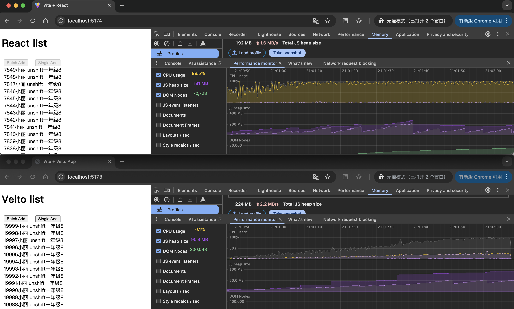
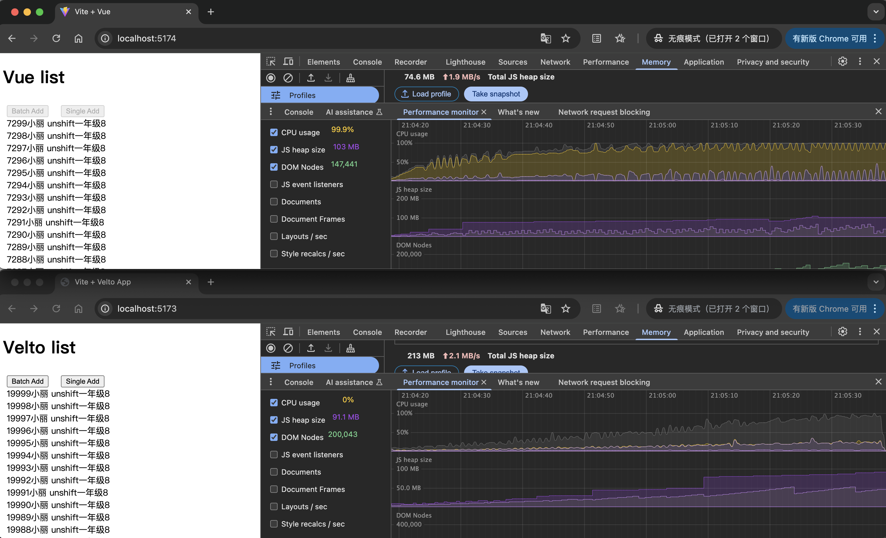
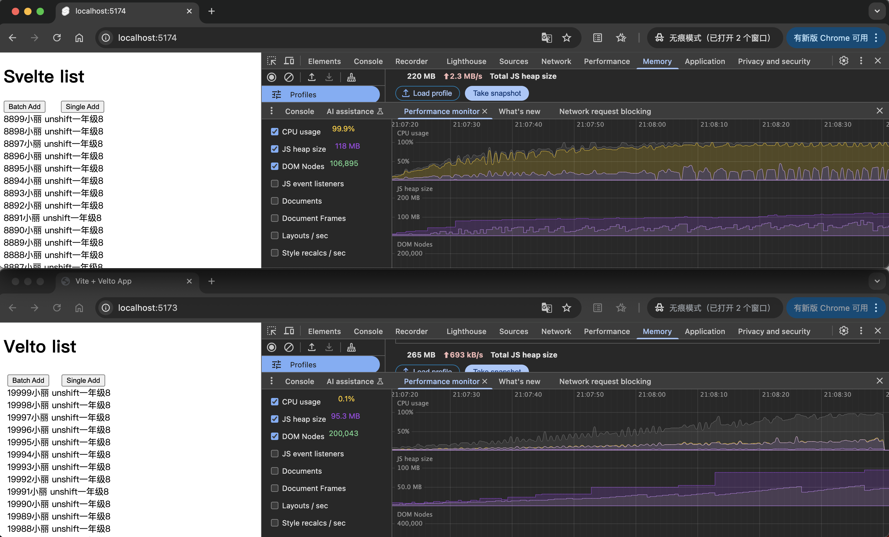
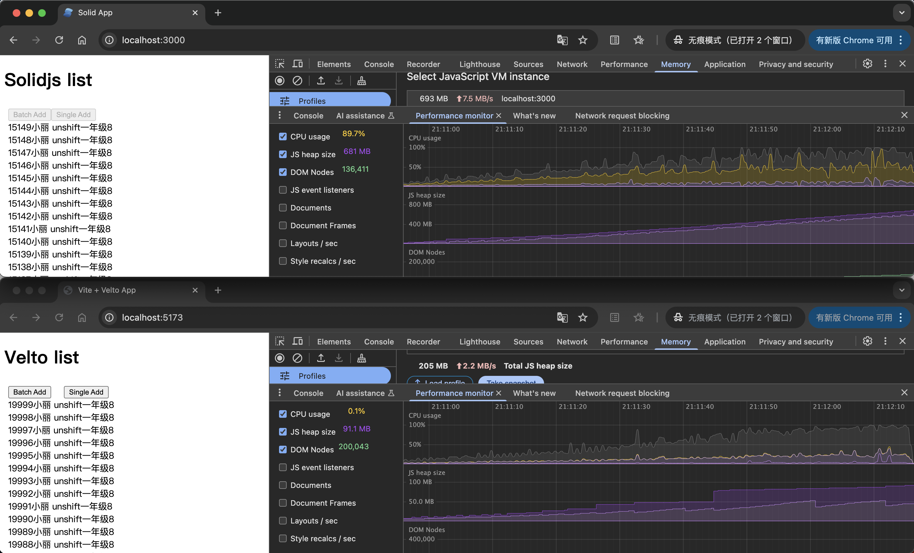

# 性能对比

[性能对比源码](https://github.com/examples-1/velto-performance-comparison)

## 与 React 框架对比

## 与 Vue 框架对比

## 与 Svelte 框架对比

## 与 SolidJs 框架对比

## Velto 的性能优势总结
1. 极低的 CPU 使用率
其他框架在执行大量 DOM 操作时（大量插入列表项）CPU 使用率迅速飙升至 90% 以上，而 Velto 在相同条件下保持在较低的使用率，说明其调度机制极为高效，对主线程负担极小。

2. 内存控制优异
React、Svelte、SolidJS 的 JS Heap 都在 100MB ~ 681MB 范围，尤其是 SolidJS 占用了 681MB 内存。Velto 即使渲染 最多的 DOM 节点数（20万+），JS Heap 依旧维持在 90MB 左右，内存分配和释放显然更为精细。

3. 可扩展性强：DOM Nodes 多而不卡
Velto 能够稳定渲染 200,043 个 DOM 节点，而其他框架大多在 7万至14万左右。即便如此，Velto 的 UI 表现依旧流畅，内存曲线平稳，说明它具备良好的 大规模 UI 渲染能力。

4. 通过这些对比，Velto 展现出了一种非常“工程化友好”的性能特性：

* 适合需要频繁更新 UI 或海量数据展示的场景（如实时系统、日志流、监控仪表盘等）。

* 性能稳定，资源开销小，非常适合部署在 低资源设备 或对性能要求极高的应用中。